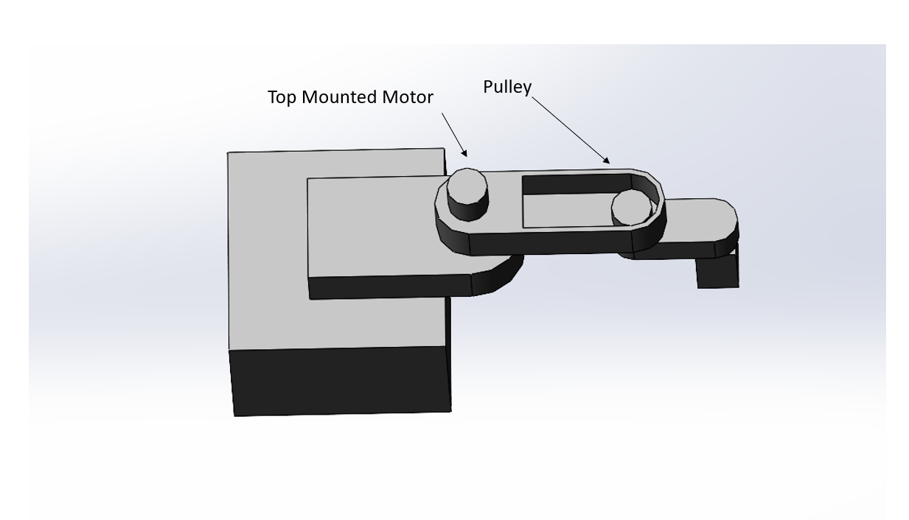

# Scara Engraver
## Our Scara Plotter Proposal

> Our ink plotter draws inspiration from the SCARA robot. It will be a 2.5 DOF
> machine capable of moving in the x and y direction and half a degree of 
> freedom for the z-axis. The two axes move in a circular direction while the 
> laser engraver turns on and off. 
>
> A rough schematic of our Scara CAD model is shown above where the two arms
> are mounted atop a large base with motors pulling at each of these arms. 
> At the very end of the second arm is our large engraver which will follow 
> the path of our HPGL code to produce our image. As for manufacturing our 
> robot, we will include rotary thrust bearings and bushings to allow the arms 
> to rotate smoothly. 

| Qty. | Part                  | Source                | Est. Cost |
|:----:|:----------------------|:----------------------|:---------:|
|  2   | DC Geared Motor w/ Enc| DFRobot               |    $60    |
|  1   | Nucleo with Shoe      | ME405 Tub             |     -     |
|  1   | Comgrow 24V Laser     | Amazon                |    $57    |
|  1   | 5A Power MOSFETs      | Digi-Key              |   $0.63   |
|  1   | Laser Shields         | Jtechphotonics        |    $17    |
|  2   | 1/4" Thurst Ball Bear | McMaster-Carr         |   $4.68   |
|  2   | Moment Bearing        | McMaster-Carr         |    ???    |    
|  3   | 3D Printed Housing    | Jeremy's Printer      |     -     |
|  2   | Limit Switches (Mini) | Grainger              |   $2.71   |
|  1   | 6 mm ID Timing Pulley | VXB                   |   $3.95   |