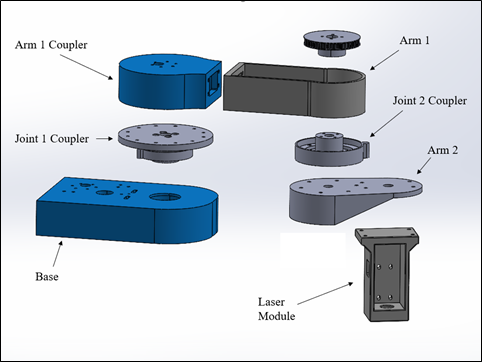
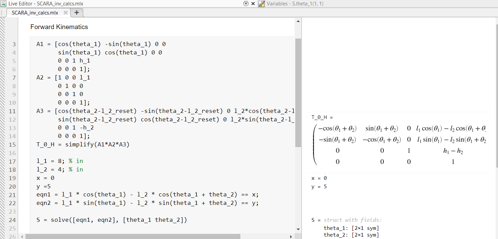

# SCARA Engraver
## Scara Robot Term Project Report
### Introduction
> Over the course of the last three weeks, our team was tasked with designing 
> and manufacturing the software and hardware needed to actuate a 2.5 degree of 
> freedom pen plotter. The purpose of this assignment was to integrate mechatronics
> design aspects covered in the last two courses in a cumulative design project. 
> The first week our team spent time researching various designs and narrowing down our design.
> During this week we decided that we were going to build a laser engraver that mimicked 
> the Selective Compliance Assembly Robot Arm (SCARA) robot design. 

> While our design did not incorporate any selectively compliant mechanisms, 
> we did follow the two rotational link design that is characteristic of these 
> types of robots.  These arms were designed such that the first link was 8 in
> long and the second link was 4in long, creating a radial workspace encompassing 
> a 12in radius circle at its max and a 4in radius at its minimum. 
>
> This engraver is meant to be able to be used by anyone by downloading the 
> xyplotter app used to draw designs and loading those text files onto the Nucleo.
> Safety was a major concern for our project given we were utilizing a high-powered
> laser for engraving, we needed to design an enclosure we could use to shield the laser 
> from the surroundings while adding a laser shielding plate which would be used to view the 
> progress and operation of the engraver. These safety features, combined with an ISR protocol 
> which would turn off the laser when the safety door is opened allow this machine to be operated 
> by anyone. Over the duration of this project, we focused our efforts on designing the necessary 
> hardware and software which would be used to laser engrave soft materials. 
### Hardware
> The hardware design for our laser engraver robot was adapted from an existing 
> design released by HowToMechatronics [1]. This design, titled SCARA Robot, 
> consists of two rotational joints as well as a lead screw for actuation along the vertical axis.
> Our design eliminated the lead screw and its corresponding components and replaced the original
> end effector, a mechanical gripper, with a Creality 3D Printer Laser Engraver [2]. 
> These alterations reduced the degrees of freedom to 2.5 (2 rotational DOFs and 0.5 DOFs to 
> toggle power supply to the laser). 
>
> The frame of each component was 3D printed using PLA and assembled with standard metric fasteners.
> The major frame components include the base, joint 1 coupler, arm 1 coupler, arm 1, 
> joint 2 coupler, arm 2, and the laser module. The base features a total of 12 M4 clearance 
> holes for fastening the base to a platform. It also has mounting holes for the first motor. 
> The joint 1 coupler slots into the base and is held in place by a pulley actuated by the base motor.
> The coupler is secured radially by a ball bearing press fit into the base. Two thrust bearings,
> one on top of the ball bearing and one below, allow the joint 1 coupler to rotate smoothly. 
> The joint 1 coupler rigidly attaches to the arm 1 coupler. The arm 1 coupler has mounting 
> holes for attaching motor 2 and is rigidly attached to arm 1. A slot at the interface 
> between the arm 1 coupler and arm 1 allows a pulley belt to pass through. Joint 2 is 
> assembled similarly to joint 1. The joint 2 coupler slots into arm 1 and is fastened 
> to a second pulley. Joint 2 has the same bearing configuration as joint 1. 
> The output shaft from motor 2 is connected via pulley belt to the joint 2 coupler pulley. 
> The joint 2 coupler is rigidly attached to Arm 2. At the end of arm 2, 
> the laser module is mounted with 4 screws. 

> Joint 2 is assembled similarly to joint 1. The joint 2 coupler slots into 
> arm 1 and is fastened to a second pulley. Joint 2 has the same bearing 
> configuration as joint 1. The output shaft from motor 2 is connected via 
> pulley belt to the joint 2 coupler pulley. The joint 2 coupler is rigidly
> attached to arm 2, and the laser module is mounted to the end of arm 2.
>
> The actuation of each arm is achieved via two DC motors [3] and a series of pulleys. 
> Motor 1 is mounted to the base and uses a single pulley to translate the rotational
> motion to joint 1. The second motor is mounted to the arm 1 coupler and uses a series 
> of two belts and a pulley to translate rotational motion to joint 2. By using pulleys, 
> we were able to mount both motors from the top, reducing interference issues. 
> It also allowed us to mount motor 2 along the joint 1 axis rather than at joint 2.
> This was advantageous because the motor’s weight is distributed over the axis, 
> reducing the inertia of arm 2 and effectively the torque requirements of motor 1. 
> Additionally, a reduced moment of inertia increases the motor’s ability to achieve 
> the specified rotation by reducing overshoot effects. 
>
> The entire assembly is mounted to a raised platform 6in above the base plate. 
> The raised platform is necessary to elevate the tip of the laser off the workpiece 
> to an appropriate height for engraving. The base plate is a 12 in x 12 in x 0.75in 
> particle board that provides stabilization to the entire assembly as well as a 
> surface to secure the workpiece and safely absorb the laser beam if it were to 
> engrave outside the limits of the workpiece. 
>
> Finally, we built an enclosure that fully encompassed the robot to protect 
> the users and bystanders from the optical hazards of the laser when in use. 
> The enclosure, primarily constructed from cardboard and duct tape, consists 
> of 4 walls and a top so that it can be set down over the robot. 
> The top features a laser shied [4] lid so that the robot can be viewed during operation.
> The lid is complete with a handle, makeshift hinge, and a limit switch to detect whether the lid is fully closed. 
> Links for parts can be found below:
>
> [1] https://howtomechatronics.com/projects/scara-robot-how-to-build-your-own-arduino-based-robot/
> [2] https://www.amazon.com/Creality-Engraver-Engraving-Attachment-Blue-Violet/dp/B08SHCJ7V4
> [3] https://www.dfrobot.com/product-633.html
> [4] https://jtechphotonics.com/?product=445nm-laser-shielding
>
### Software
> Our full source code documentation can be found here: https://jedbaechler.github.io/Scara-Engraver/.
>
> In summary, we have three tasks ran by our scheduler: a position checker and two motor tasks. 
> A user input first sends the initial x and y coordinates. Then these coordinates 
> are converted into arm angle setpoints using inverse kinematics. 
> The position checker then receives these theta values which are to be compared 
> to current encoder readings. If the desired setpoints have been reached by both arms, 
> the next setpoint is queued in. This value is taken by our motor tasks where our controller 
> computes an appropriate PWM for our motors.
### Results
> Our demonstration left a lot to be desired. We were debugging our code up until
> the point we showed our project to the class. As our hardware took more time to ship,
> we started by testing our software. We performed the inverse kinematic calculations using
> the Denavit-Hartenberg method we learned from ME-423 Robotics. Once we found these equations, 
> we used the ‘solve’ function on MATLAB to solve for theta1 and theta2. 

>
> We tested many easy points, such as (0,4) and (4,0) where the first arm would 
> be perpendicular to the base and the second arm supplementary, and vice versa. 
> However, the same level of inspection was not used to debug our controller. 
> Our queued values all made sense, as we wanted to just follow a line for one test; 
> however, the controller spewed PWM values that would not have set our motor to our set point.
> Notably, during testing we found that many PWM values being sent out were “0.” 
> Despite these stalls to our progress, our group wants to continue this project to finish what we started and be able to call project successful. 
>
### Discussion
> For anyone who would like to continue where we ended, we recommend first making sure 
> the wiring to the laser is connected as this became a problem only on the last day. 
> Assuming hardware is good, the major software that must be modified is our controller.
> The task scheduler amazingly works well and in time. Another method for diagnostic testing 
> we recommend is creating a list of setpoints at least one revolution apart from each other 
> to affirm whether the motors can handle the step response. The biggest learning experience 
> we had from this term project is the use of tasks. We did not use this for our controller 
> task prior in the lab nor in ME-305. However, on this final term project we all learned the
> appropriate way to syntax queues being shared as well as an appropriate priority and running period.
> Lastly, I would recommend rechecking our position checker task. 
> It currently feeds theta values to our motor tasks if the encoder reads two simultaneous
> values to be equivalent to the last set point. However, if the encoder is indeed reading 
> multiple equivalent values due to lag from the microcontroller’s computation time, 
> the motors will skip to the next setpoint without having reached the prior setpoint. 

    